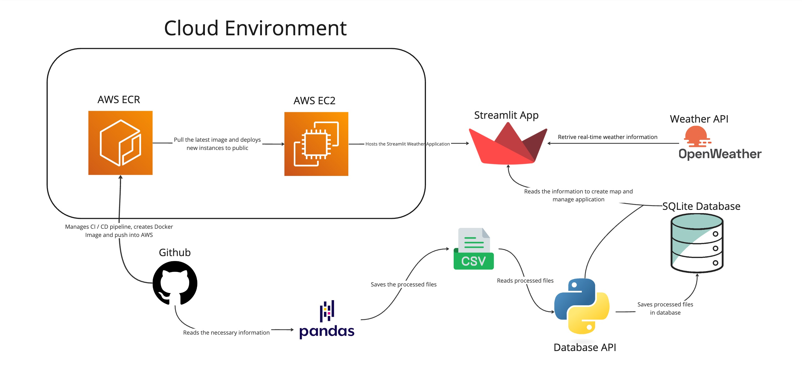

# Final Project

# 1. what the project does
# 2. dependencies

# 3. How to Run the Streamlit Dashboard

## Step 1: Install Required Libraries
To ensure you have all the necessary libraries, run the following commands in your terminal or command prompt:
```bash
pip install streamlit
pip install folium
pip install streamlit-folium
```

## Step 2: Install Required Libraries
1. Open a terminal or command prompt in the directory where your Python file (new_main.py) is saved.
2. Run the following command:
```bash
streamlit run new_main.py
```
## Step 3: View the Dashboard
Open the Local URL (e.g., http://localhost:8501) in your web browser to view the dashboard.


# 4. Infrastructure as Code (IaC) Process

### **1. Installing and Configuring Docker**
1. Update the system and install Docker:
   ```bash
   sudo dnf update -y
   sudo dnf install docker -y
    ```
2. Start and enable the Docker service:
   ```bash
    sudo systemctl start docker
    sudo systemctl enable docker

    ```
3. Add the EC2 user to the Docker group for permission management
   ```bash
   sudo usermod -a -G docker ec2-user
    ```

### **2.  Setting Up AWS Credentials**
1. Create the `.aws` directory and set up credentials and configuration files:
   ```bash
   mkdir -p ~/.aws
    echo "[default]" > ~/.aws/credentials
    echo "aws_access_key_id=${AWS_ACCESS_KEY_ID}" >> ~/.aws/credentials
    echo "aws_secret_access_key=${AWS_SECRET_ACCESS_KEY}" >> ~/.aws/credentials
    echo "[default]" > ~/.aws/config
    echo "region=${AWS_REGION}" >> ~/.aws/config
    ```
2. Start and enable the Docker service:
- **AWS_ACCESS_KEY_ID:** Your AWS access key ID.  
- **AWS_SECRET_ACCESS_KEY:** Your AWS secret access key.  
- **AWS_REGION:** The AWS region hosting your resources.  


### **3. Pulling the Docker Image from ECR**
1. Authenticate Docker with ECR using AWS CLI:
   ```bash
   aws ecr get-login-password --region ${AWS_REGION} | docker login --username AWS --password-stdin ${ECR_REGISTRY}
    ```
2. Remove unused Docker images to free space:
   ```bash
    docker image prune -f
    ```
3. Pull the application Docker image from ECR:
   ```bash
   docker pull ${ECR_REGISTRY}/${ECR_REPOSITORY}:${IMAGE_TAG}
    ```
    

### **4. Running the Containerized Application**
1. Stop and remove any existing containers to ensure a clean start:
   ```bash
   sudo docker stop weather_app || true
    sudo docker rm weather_app || true
    ```
2. Run the application container:
   ```bash
    sudo docker run -d -p 9999:9999 --name weather_app \-e WEATHER_API_ACCESS_TOKEN=${WEATHER_API_ACCESS_TOKEN} \${ECR_REGISTRY}/${ECR_REPOSITORY}:${IMAGE_TAG}
    ```


### **5. Verifying Environment Variables**
To ensure the container is properly configured:
   ```bash
   sudo docker exec weather_app sh -c 'echo $AWS_ACCESS_KEY_ID && echo $AWS_SECRET_ACCESS_KEY && echo $AWS_REGION'
```  


##  Deployment Workflow


# 5. Load Test and Quantitative Assessment 


•	`Load_test.py`: we created this script to conduct load testing to evaluate our weather application's performance. 

•	We used Locust to perform the load testing, to verify the microservice's performance. The testing result shows that when scaling to 10,000 concurrent users, our microservice demonstrates strong system reliability and stability, with the service maintaining a consistent 0% failure rate throughout the testing duration while handling approximately 1,800-2,000 requests per second (RPS). The reason why the actual RPS is below our 10,000 RPS target is because OpenWeather API sets a free tier limit of 2,000 calls per day, resulting this bottleneck for the performance. However, as evidenced by the steady RPS graph maintaining around 1,800-2,000 requests per second once reaching peak load and a consistent response time pattern, our system exhibits excellent stability. 


# 6. Limitations & Future Improvement


# 7. AI Pair Programming Tool: GitHub Copilot
We write our code in Visual Studio Code and leverage AI tools for debugging assistance and code suggestions. These tools have proven to be invaluable in streamlining and enhancing our development process.
