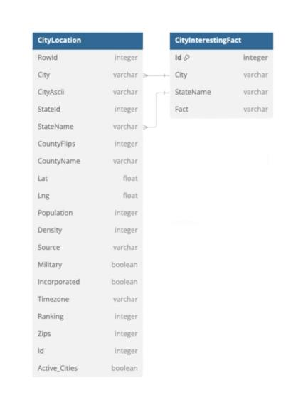
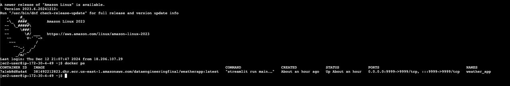
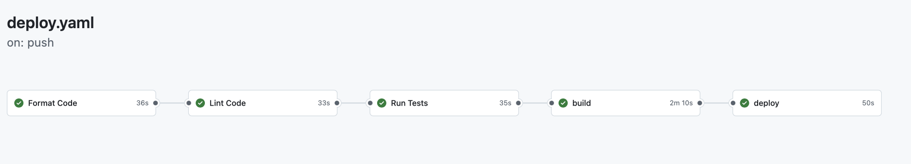
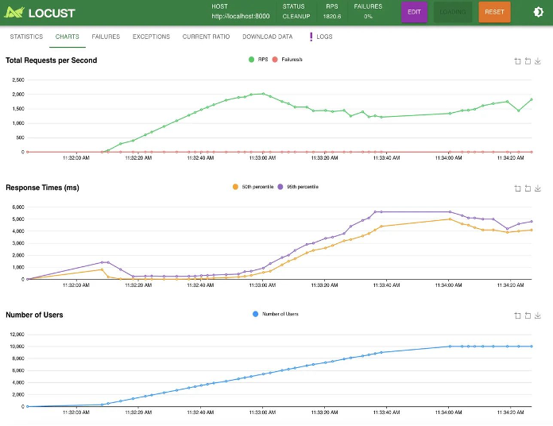

# Data Engineering Final Project: Real-time Weather Forecast Application
[](https://github.com/Cavidan-oss/IDS_706_Final_Project/actions/workflows/deploy.yaml)

### Team members

Javidan Karimli, Ramil Mammadov, Jennifer Li, Shiyue Zhou

[Watch the video on YouTube](https://youtu.be/iKW_625ALNQ)


[Link to application](http://52.91.149.188:9999)


### Architectural Diagram


# 1. Overview
This application provides real-time weather details and interesting information for locations across the United States. It leverages multiple components and a robust cloud infrastructure to ensure reliable and efficient performance. The project integrates key data engineering principles, employs Infrastructure as Code (IaC) for automated resource management, and implements a CI/CD pipeline to streamline development and deployment processes.

# 2. Main components
Several components work together seamlessly to ensure the full functionality of the weather application.

### 1) SQL Lite
The SQLite database is used to store all the essential data required by the weather application, including city locations and detailed information about them. This database was chosen for its lightweight nature and fast performance, making it ideal for handling localized application data efficiently. It plays a critical role in providing a structured and reliable storage solution.Here is the table schema structure for the weather application.



### 2) Database API
The Database API serves as a bridge between the application and the SQLite database, encapsulating all interactions to ensure efficiency and consistency. It simplifies tasks such as spinning up a new database from scratch, retrieving, and uploading CSV files into the database. Additionally, the API handles exception management, logging, and database optimization to ensure smooth operations and reliability.

### 3) Weather API
The Weather API is responsible for retrieving real-time weather data for the specified cities. It manages all interactions with the OpenWeather API, including handling the API key securely and managing error handling. Beyond fetching current weather data, it also supports future weather forecasting, making it a versatile and integral component of the application.

### 4) Streamlit Application
Streamlit serves as the front-end service, facilitating all user interactions with the weather application. The web interface is divided into two main sections: a map and a dashboard, offering users an intuitive and interactive experience. The map functionality is powered by Folium, with seamless integration achieved through the streamlit-folium library, enabling dynamic and interactive geospatial visualizations directly within the application. Performance considerations, such as optimizing response times and ensuring smooth interactions, are carefully implemented to enhance usability and provide an optimal user experience.

### 5) Pandas for data processing
Pandas is utilized for processing all necessary data, such as city locations and related information, to prepare it for use in the SQLite database. It enables efficient transformation of raw data into a structured format that aligns with the database model, ensuring seamless integration and high-quality data preparation.

### 6) AWS Cloud Services
To ensure a robust, scalable, and environment-agnostic deployment, the weather application is containerized using Docker and hosted on an AWS EC2 instance for public accessibility. The AWS Elastic Container Registry (ECR) is integrated to manage Docker images and keep them up to date. Deployment and updates are fully automated through a CI/CD pipeline powered by GitHub Actions, ensuring streamlined and reliable cloud-based operations.

# 3. Dependencies
The application utilizes several libraries and tools to deliver a seamless user experience:  
- **Streamlit**: For building the interactive front-end interface.  
- **Streamlit-Folium**: For integrating and displaying dynamic maps using Folium within the Streamlit application.  

All required libraries are listed in the `requirements.txt` file. To test the application locally, users must create an access key on the [OpenWeather website](https://openweathermap.org/api), then store it in a `.env` file with the following key name:  

```plaintext
WEATHER_API_ACCESS_TOKEN=<Your_Access_Key>
```


# 4. How to Run the Streamlit Dashboard

## Step 1: Install Required Libraries
To ensure you have all the necessary libraries, run the following commands in your terminal or command prompt:
```bash
make install
```

## Step 2: Correct structure

Since the database is included with the application, there is a possibility of data loss during file movement or deployment. To ensure proper functionality, follow these steps:  

### 1. Verify the existence of the database file at:  
   `data/db/application.db`  

### 2. If the database file is missing, run the following command to set up the database:  
   ```bash
   python deployment.py
   ```
Ensure you have created a .env file in the root directory with the appropriate OpenWeather API access key to enable weather data retrieval as discussed above.


## Step 3: Run the application
1. Open a terminal or command prompt in the directory where your Python file (main.py) is saved.
2. Run the following command:
```bash
streamlit run main.py
```
## Step 4: View the Dashboard
Open the Local URL (e.g., http://localhost:8501) in your web browser to view the dashboard.


# 5. Deployment

The application is fully deployed using Docker, with two distinct Dockerfiles included in the project:  

1. **Development Environment (`.devcontainer`):**  
   The Dockerfile located under `.devcontainer` is designed to provide a reproducible development environment inside GitHub Codespaces. This allows users to pull the repository and use it seamlessly within Codespaces.  
   - **Recommendation:** Activate the "docker-in-docker" option in Codespaces to ensure proper functionality, as the application itself runs in a separate Docker container.  

2. **Application Deployment (`App.Dockerfile`):**  
   The `App.Dockerfile`, located in the root directory, is responsible for containerizing the application for production deployment. This Dockerfile ensures the application is optimized and packaged in an efficient and portable manner.  

By leveraging these Dockerfiles, the application offers flexibility for both development and deployment while maintaining consistency and efficiency.

# 6. Infrastructure as Code (IaC) Process

### **1. Installing and Configuring Docker**
1. Update the system and install Docker:
   ```bash
   sudo dnf update -y
   sudo dnf install docker -y
    ```
2. Start and enable the Docker service:
   ```bash
    sudo systemctl start docker
    sudo systemctl enable docker

    ```
3. Add the EC2 user to the Docker group for permission management
   ```bash
   sudo usermod -a -G docker ec2-user
    ```

### **2.  Setting Up AWS Credentials**
1. Create the `.aws` directory and set up credentials and configuration files:
   ```bash
   mkdir -p ~/.aws
    echo "[default]" > ~/.aws/credentials
    echo "aws_access_key_id=${AWS_ACCESS_KEY_ID}" >> ~/.aws/credentials
    echo "aws_secret_access_key=${AWS_SECRET_ACCESS_KEY}" >> ~/.aws/credentials
    echo "[default]" > ~/.aws/config
    echo "region=${AWS_REGION}" >> ~/.aws/config
    ```
2. Start and enable the Docker service:
- **AWS_ACCESS_KEY_ID:** Your AWS access key ID.  
- **AWS_SECRET_ACCESS_KEY:** Your AWS secret access key.  
- **AWS_REGION:** The AWS region hosting your resources.  


### **3. Pulling the Docker Image from ECR**
1. Authenticate Docker with ECR using AWS CLI:
   ```bash
   aws ecr get-login-password --region ${AWS_REGION} | docker login --username AWS --password-stdin ${ECR_REGISTRY}
    ```
2. Remove unused Docker images to free space:
   ```bash
    docker image prune -f
    ```
3. Pull the application Docker image from ECR:
   ```bash
   docker pull ${ECR_REGISTRY}/${ECR_REPOSITORY}:${IMAGE_TAG}
    ```
    

### **4. Running the Containerized Application**
1. Stop and remove any existing containers to ensure a clean start:
   ```bash
   sudo docker stop weather_app || true
    sudo docker rm weather_app || true
    ```
2. Run the application container:
   ```bash
    sudo docker run -d -p 9999:9999 --name weather_app \-e WEATHER_API_ACCESS_TOKEN=${WEATHER_API_ACCESS_TOKEN} \${ECR_REGISTRY}/${ECR_REPOSITORY}:${IMAGE_TAG}
    ```


##  CICD Deployment Workflow



# 7. Load Test and Quantitative Assessment 



•	`Load_test.py`: we created this script to conduct load testing to evaluate our weather application's performance. 

•	We used Locust to perform the load testing, to verify the microservice's performance. The testing result shows that when scaling to 10,000 concurrent users, our microservice demonstrates strong system reliability and stability, with the service maintaining a consistent 0% failure rate throughout the testing duration while handling approximately 1,800-2,000 requests per second (RPS). The reason why the actual RPS is below our 10,000 RPS target is because OpenWeather API sets a free tier limit of 2,000 calls per day, resulting this bottleneck for the performance. However, as evidenced by the steady RPS graph maintaining around 1,800-2,000 requests per second once reaching peak load and a consistent response time pattern, our system exhibits excellent stability. 


# 8. Limitations and Future Improvements

The application currently faces several limitations. It is constrained by the rate limits of the WeatherAPI, which restrict the frequency of data retrieval. Additionally, the lack of caching mechanisms leads to redundant API calls and slower performance, particularly for map objects and refreshing content. Streamlit's current capabilities also pose challenges in handling highly interactive and dynamic content across the website, which can impact user experience. For future improvements, allowing users to input their own WeatherAPI access keys could help bypass rate limits and provide more flexibility. Implementing caching methodologies would significantly reduce the number of API calls and improve overall efficiency. Furthermore, optimizing Streamlit's handling of interactive elements would enhance the user experience, making the application more robust and user-friendly.


# 9. AI Pair Programming Tool: GitHub Copilot
We write our code in Visual Studio Code and leverage AI tools for debugging assistance and code suggestions. These tools have proven to be invaluable in streamlining and enhancing our development process.


